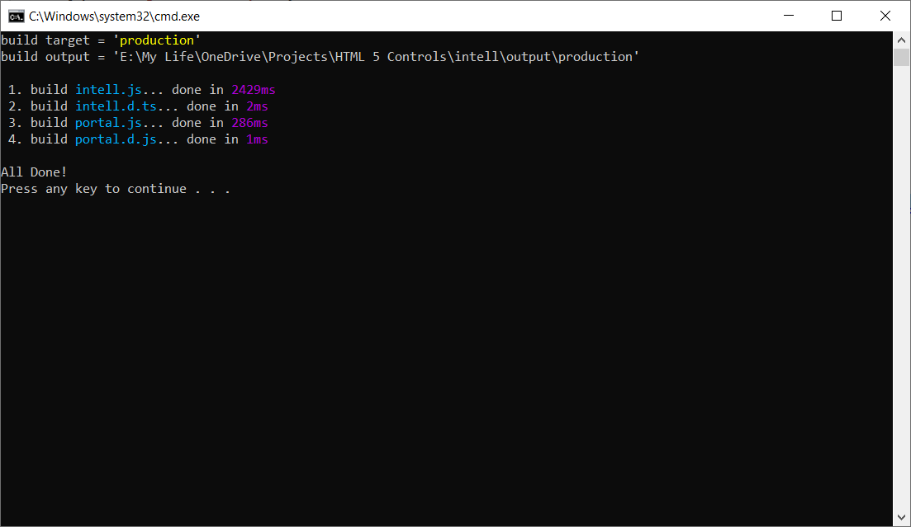

# Intell Javascript
jIntell is a JavaScript library designed to simplify using many controls while writing projects. This project is a part of X High Intell for private use only, so updates or modifiers can change the whole structure.

## Documentation
You can find more documents & examples on [jintell.xhighintell.com](http://jintell.xhighintell.com/)

## Build
Our target is web/electron platform, we have written build commands for development and production in `intell\build` folder:

1. `build development.cmd` build without minifing and source map.
2. `build production.cmd` include minify file and source map.

In order to run build comment, you need to install NodeJs with the following components:

- [x] npm install babel-core
- [x] npm install babel-core
- [x] npm install uglify-js
- [x] npm install intell-node

